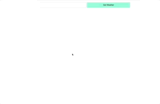

# forecaster
Tasked with writing a program that requests a weather report from a server, then does two additional API calls and displays it to the user.

## Demo - 
Deployed frontend:
https://rdrachenberg.github.io/forecaster/

    

